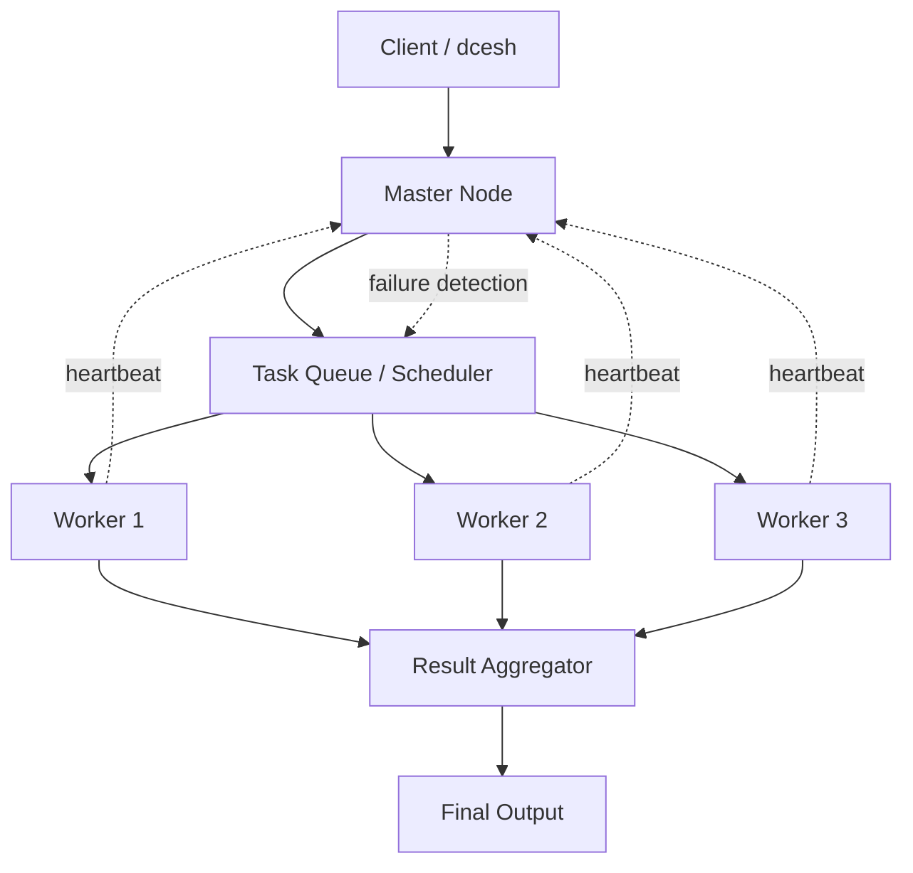

# Distributed Compute Engine


A small distributed compute engine that runs Python jobs across worker processes using a master/worker architecture. The project focuses on TCP networking, scheduling, worker heartbeats, basic failure detection, and collecting job output.

## Demo

The quickest demo starts the master, launches a few workers in separate terminals, and submits sample jobs:

```bash
./demo.sh
```

In separate terminals:

```bash
python3 -m worker.worker1
python3 -m worker.worker2
python3 -m worker.worker3
```

Then return to the `demo.sh` terminal and press Enter to submit demo jobs.

## What Problem It Solves

This project shows the core pieces behind a simple distributed job runner:

- accepting work from a client
- tracking available workers
- assigning jobs to idle workers
- detecting missing workers with heartbeats
- collecting output after a worker finishes

It is not meant to be a production system. It is a learning project for distributed systems basics.

## Architecture



The master listens on port `9000`. Workers listen on ports `9101`, `9102`, and `9103`. Workers send heartbeat messages back to the master so the master can mark a worker dead if it stops responding.

## Features

- Master node that accepts job submissions over TCP
- Worker nodes that execute assigned Python jobs in Docker
- FIFO job queue when no worker is available
- Heartbeat-based worker health tracking
- Requeueing for jobs assigned to workers that stop heartbeating
- Simple shell client for submitting jobs and reading logs
- Demo script and sample workload for screenshots

## Tech Stack

- Python 3
- TCP sockets
- Threads
- Docker for job execution
- Bash demo script

## Build And Run Locally

Requirements:

- Python 3.10 or newer
- Docker, if using `worker/worker1.py`, `worker/worker2.py`, or `worker/worker3.py`
- macOS or Linux shell

Run a quick syntax check:

```bash
python3 -m py_compile master/master.py worker/worker1.py worker/worker2.py worker/worker3.py shell/dcesh.py protocol/*.py
```

Start the master:

```bash
python3 -m master.master
```

Start workers in separate terminals:

```bash
python3 -m worker.worker1
python3 -m worker.worker2
python3 -m worker.worker3
```

Submit a job through the shell:

```bash
python3 -m shell.dcesh
submit examples/distributed_sum.py
status job1
logs job1
```

## Example Demo Commands

```bash
./demo.sh
```

Manual submission without the helper script:

```bash
python3 -m shell.dcesh
```

Inside the shell:

```text
submit examples/distributed_sum.py
status job1
logs job1
```

## Screenshots

Suggested screenshots are listed in [docs/screenshots.md](docs/screenshots.md).

Place final images in a future `docs/screenshots/` folder:

- master starting
- three workers connecting
- jobs being assigned
- failed worker detection
- final result aggregation

## Demo GIF / Video

Placeholder: add a short GIF or screen recording showing the master, three workers, and one submitted job completing.

Suggested path:

```text
docs/demo/dce-demo.gif
```

## Folder Structure

```text
master/       Master node, scheduler, worker health tracking
worker/       Worker processes and Docker-based job execution
protocol/     TCP client/server helpers
shell/        Simple interactive command shell
docker/       Dockerfiles for local/container experiments
docs/         Architecture, demo, screenshot, and portfolio notes
examples/     Sample workloads for demos
```

## Limitations

- Workers are configured with fixed local ports.
- Jobs are assigned as whole Python scripts; one submitted job is not split into smaller chunks yet.
- Job execution currently depends on Docker in the numbered worker scripts.
- The protocol is plain text and intended for learning/debugging.
- There is no authentication, persistent storage, or web dashboard.

## What I Learned

- How to structure a master/worker system over TCP sockets
- How heartbeat messages can support basic failure detection
- How scheduling changes when workers can be idle, busy, or dead
- How to collect remote execution output and expose it through a client shell
- Why production distributed systems need stronger protocols, retries, and observability

## Future Improvements

- Split one large job into smaller task chunks
- Add dynamic worker registration instead of fixed ports
- Store job history in a small database
- Add a browser dashboard for live worker and job status
- Replace the plain-text protocol with structured messages
- Add automated integration tests for master/worker behavior

## Resume Bullet Examples

- Built a Python-based distributed compute engine with a TCP master/worker architecture, job queueing, worker heartbeats, and result collection.
- Implemented basic fault detection by monitoring worker heartbeats and requeueing jobs when a worker stopped responding.
- Created a Docker-backed worker execution flow and command-line shell for submitting jobs, checking status, and viewing logs.

## More Documentation

- [Architecture Notes](docs/architecture.md)
- [Demo Guide](docs/demo.md)
- [Screenshot Checklist](docs/screenshots.md)
- [Portfolio Copy](docs/portfolio-copy.md)
