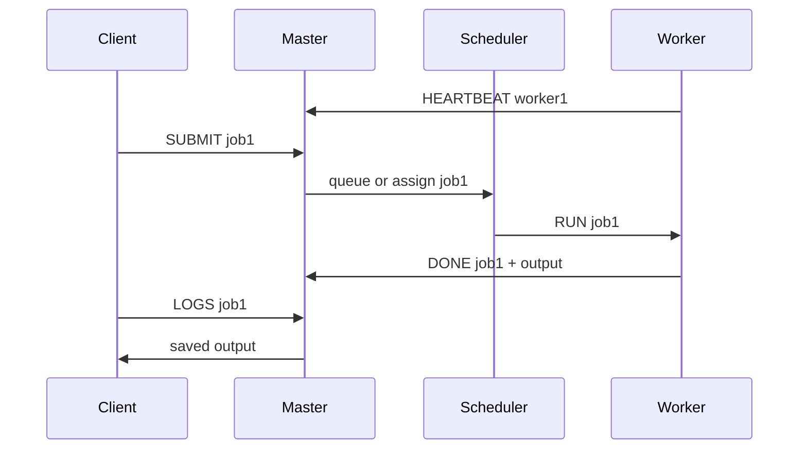

# Architecture Notes

This project uses a simple master/worker design.

## Components

### Client

The client can be the interactive shell in `shell/dcesh.py` or a direct TCP request. It submits a Python file as a job and can ask the master for job status or logs.

### Master Node

The master listens on port `9000`. It keeps track of:

- known workers
- worker status: idle, busy, or dead
- recent heartbeat times
- submitted jobs
- queued jobs waiting for a worker

### Scheduler

The scheduler assigns queued jobs to workers that are both idle and recently heartbeating. If every worker is busy or unavailable, the job stays in the FIFO queue.

### Workers

Workers listen on fixed local ports:

- `worker1`: `9101`
- `worker2`: `9102`
- `worker3`: `9103`

Each worker sends heartbeat messages to the master and waits for `RUN` messages. Numbered workers execute the submitted Python file inside a Docker `python:3.10` container, then send the output back to the master.

### Result Aggregation

When a worker sends a `DONE` message, the master stores the job output and marks the worker idle again. Logs can be read through the shell with `logs job1`.

## Message Flow

## Failure Detection

Workers send heartbeats every few seconds. If the master has not heard from a worker within the timeout window, it marks the worker dead. If that worker had a running job, the master puts the job back into the queue.

This is intentionally basic. It is enough to demonstrate the idea, but production systems would need stronger retries, message IDs, durable state, and better process supervision.
